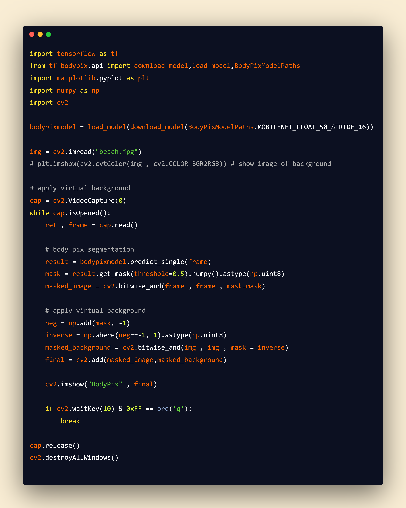

# Body-Segmentation-using-bodypix
* In this project we will try to mask our body and try to fit it in another image or we can say we transform our body to another background.

# Snapshot Of Code 💫:



# Install Following Dependencies 👇:
```
pip install tf_bodypix tfjs_graph_converter matplotlib opencv-python
```

# Requirements & Helful Documentation⭐:
* opencv : https://docs.opencv.org/master/index.html
* matplotlib : https://matplotlib.org/stable/contents.html
* tensorflow : https://www.tensorflow.org/api_docs
* bodypix : https://github.com/de-code/python-tf-bodypix


# Code ⬇️:
* Download Code as Zip **OR**
```
git clone https://github.com/manthan89-py/Blog-Summarizer.git
```

# Main Credits and Video Tutorial ❤️:
* Youtube : https://www.youtube.com/watch?v=0tB6jG55mig
* Github : https://github.com/nicknochnack
* Thank you very much **Nicholas Renotte** Sir🤝❤️.


# Final Note⭐:
* <h3> Bug fixing, Code error or Anything Raise issue🤚. If it any have.</h3>
* <h3> Happy to hear your sugesstions🤝 about this project.</h3>
* <h3> Feel Free to Give ⭐ to this Repository.</h3>
* <h3> Thank you very much for visiting ❤️.</h3>
* <h3> Stay Safe✌️ and Stay Healthy✌️.</h3>

